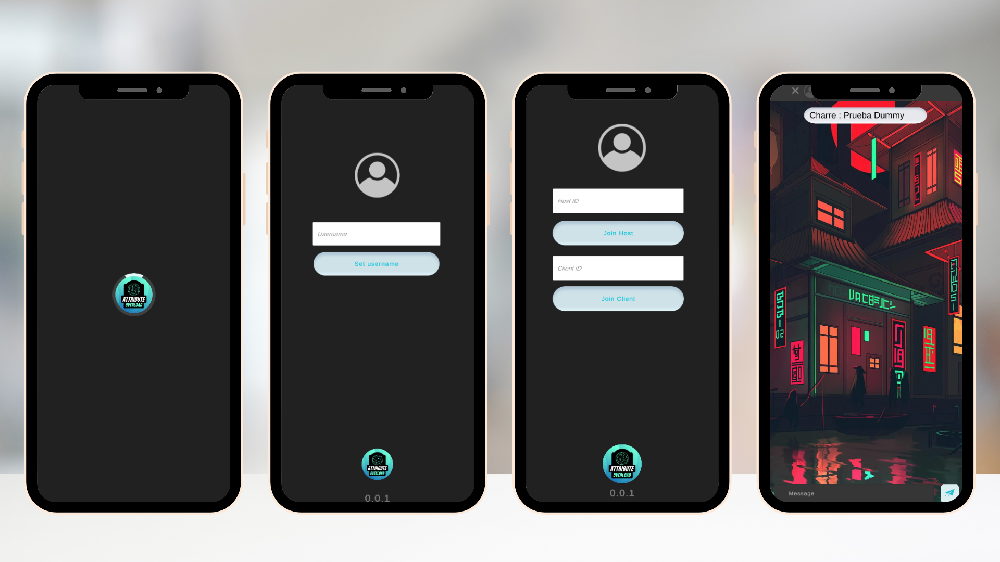

# Chat with Photon

Roberto Charreton Kaplun

## Descripción

Breve descripción del proyecto y su propósito.

## Capturas de Pantalla

## Características

- [Característica 1]
- [Característica 2]
- [Característica 3]

## Tecnologías Utilizadas

- Photon PUN
- [Otras tecnologías]

## Instalación

1. Clona el repositorio: `git clone [URL del repositorio]`
2. Instala las dependencias: `[Comando de instalación de dependencias]`

## Configuración

1. Configura [Configuración específica del proyecto].
2. Modifica [Otras configuraciones].

## Uso

Proporciona ejemplos o instrucciones sobre cómo utilizar tu aplicación.

## Contribución

Si quieres contribuir al proyecto, sigue estos pasos:

1. Haz un fork del repositorio
2. Crea una nueva rama: `git checkout -b feature/nueva-caracteristica`
3. Realiza tus cambios y haz commit: `git commit -m 'Agrega nueva característica'`
4. Haz push a la rama: `git push origin feature/nueva-caracteristica`
5. Crea un pull request en GitHub

## Licencia

Este proyecto está bajo la licencia [Nombre de la Licencia]. Consulta el archivo `LICENSE.md` para más detalles.

## Contacto

- [Tu dirección de correo electrónico]
- [Enlaces a redes sociales]

